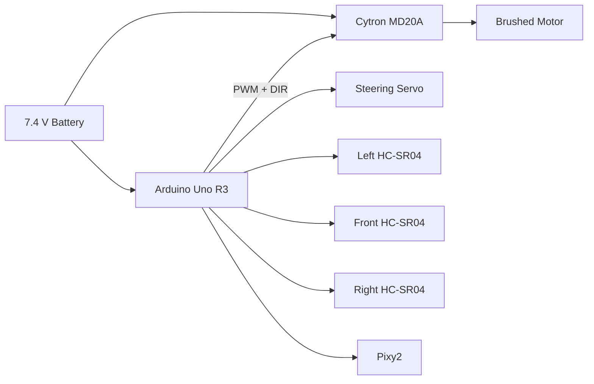
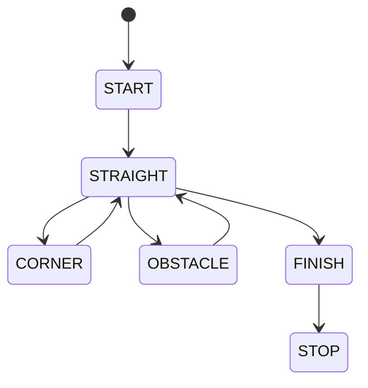

<p align="center">
  
</p>

<h1 align="center">WRO Future Engineers Documentation</h1>

<p align="center">
  <b>The Good Boys</b> | RC Car to Autonomous Robot | Arduino Uno R3 + Arduino C++
</p>

<p align="center">
  
  
  
  
  
  
</p>

---

<p align="center">
  We started with a small RC car and turned it into a programmable autonomous vehicle. Instead of designing a drivetrain from the ground up, we kept the parts that already worked well mechanically and replaced the radio-control system with our own controller, motor driver, sensors, camera, and code.
</p>

---

## Table of Contents

- [Team Information](#team-information)
- [From RC Car to Autonomous Robot](#from-rc-car-to-autonomous-robot)
- [Why We Chose This Chassis](#why-we-chose-this-chassis)
- [Mechanical Design](#mechanical-design)
- [Electrical System](#electrical-system)
- [Sensors and Camera](#sensors-and-camera)
- [Software Concept](#software-concept)
- [Open Challenge Concept](#open-challenge-concept)
- [Obstacle Challenge Concept](#obstacle-challenge-concept)
- [Engineering Decisions](#engineering-decisions)
- [Build Process](#build-process)
- [Robot Photos](#robot-photos)

---

## Team Information

| Item | Details |
|---|---|
| Team Name | The Good Boys |
| Competition | WRO Future Engineers 2026 |
| Robot Type | Autonomous four-wheel vehicle |
| Original Platform | WLtoys 284010 1/28 RC car |
| Main Controller | Arduino Uno R3 |
| Programming Language | Arduino C++ |
| Motor Driver | Cytron MD20A |
| Vision Sensor | Pixy2 CMUcam5 |
| Distance Sensors | 3 × HC-SR04 ultrasonic sensors |

<p align="center">
  
</p>

<p align="center">
  <i>The Good Boys team.</i>
</p>

---

# From RC Car to Autonomous Robot

Our project started with a **WLtoys 284010 1/28 RC car**.

The stock car already had several things we needed: four wheels, suspension, a brushed drive motor, mechanical gearing, front-wheel steering, and a compact metal chassis. Instead of throwing away a working mechanical platform, we decided to keep it and change the part that actually made the decisions.

The original car depended on a handheld radio transmitter and receiver. For WRO, the vehicle has to make its own decisions. That meant the biggest change was not the wheels or drivetrain. It was the control system.

<table>
  <tr>
    <td align="center">
      <br>
      <sub>The original RC car</sub>
    </td>
    <td align="center">
      <br>
      <sub>The chassis underneath the body</sub>
    </td>
  </tr>
</table>

### What we kept

- Four-wheel chassis
- Suspension
- Brushed 130 drive motor
- Mechanical drivetrain and gearing
- Front steering linkage
- Steering servo
- Wheels and tires
- 7.4 V battery

### What we changed

- Removed the decorative body shell
- Removed the need for the handheld radio controller
- Bypassed the original drive-control electronics
- Added an Arduino Uno R3
- Added a Cytron MD20A motor driver
- Added three ultrasonic sensors
- Added a Pixy2 camera
- Added a breadboard and new wiring
- Built an upper platform for the electronics
- Began replacing manual RC control with Arduino code

The finished idea is simple: **the RC car provides the mechanical platform, while the Arduino and sensors turn it into a robot.**


---

# Why We Chose This Chassis

We were working under a short build schedule, so starting from a proven RC chassis made more sense than spending most of our time building a steering system and drivetrain from scratch.

The stock platform already gave us:

1. Working front-wheel steering
2. A motor and gear system matched to the wheels
3. A rigid chassis
4. Four conventional wheels
5. A compact battery location
6. A drivetrain that could be controlled through one motor

The stock car is capable of much more speed than we need. For an autonomous robot, maximum speed is not the goal. We care more about being able to steer accurately, recognize the track, react to obstacles, and complete laps consistently.

That leads to an important tradeoff:

```text
more speed  = less time to sense and correct
less speed  = easier steering and more predictable behavior
```

For that reason, our plan is to limit motor speed in software instead of trying to use the RC car at its maximum speed.

---

# Mechanical Design

## Drive System

The original brushed DC motor remains connected to the car's mechanical drivetrain.

The motor is not driven directly from the Arduino. The Arduino is only responsible for the control signal. The **Cytron MD20A** sits between the Arduino and motor so it can handle the higher motor current.

```text
Arduino
   |
PWM + direction signal
   |
   v
Cytron MD20A
   |
motor power
   |
   v
Brushed motor
   |
gears
   |
wheels
```

This let us keep the original drivetrain while replacing the RC electronics that controlled it.

<!-- ADD CLOSE-UP PHOTO OF MOTOR / GEARS / MD20A CONNECTION HERE -->

## Steering

We kept the original front steering mechanism.

The steering servo moves the front wheels through the RC car's existing linkage. This is useful because the robot still steers like a normal car rather than using differential steering.

The Arduino will control the steering servo with three basic positions:

```cpp
LEFT
CENTER
RIGHT
```

The exact servo values will be adjusted on the actual robot once we begin driving tests.

<!-- ADD CLOSE-UP PHOTO OF FRONT STEERING HERE -->

## Electronics Platform

Removing the body shell gave us space above the chassis.

We used that space for a lightweight upper platform holding:

- Arduino Uno R3
- Cytron MD20A
- Breadboard
- Sensor wiring
- Ultrasonic sensor mounts
- Pixy2 mount

The main challenge was fitting the electronics onto a very small RC chassis without blocking the wheels or steering linkage.

<!-- ADD SIDE OR TOP PHOTO OF ELECTRONICS PLATFORM HERE -->

---

# Electrical System

The robot uses a **7.4 V battery** as the main power source.

The basic system is:



The important separation is:

- **Arduino:** reads sensors and makes decisions
- **MD20A:** handles drive-motor power
- **Servo:** controls steering
- **Ultrasonic sensors:** measure distances
- **Pixy2:** handles visual color detection

The motor needs the MD20A because a motor draws much more current than an Arduino output pin is designed to supply.

<!-- ADD TOP-DOWN WIRING PHOTO HERE -->

---

# Sensors and Camera

Our current robot has **three HC-SR04 ultrasonic sensors and one Pixy2 camera**.

We are using several sensors because each one has a different job.

## Left Ultrasonic Sensor

The left sensor faces toward the left side of the track.

Its intended job is to help the robot estimate how close it is to the left wall.

<!-- ADD LEFT SENSOR PHOTO HERE -->

## Front Ultrasonic Sensor

The front sensor faces forward.

Its intended job is to help the robot notice when the end of a straight or a nearby wall is approaching.

<!-- ADD FRONT SENSOR PHOTO HERE -->

## Right Ultrasonic Sensor

The right sensor faces toward the right side of the track.

Its intended job is to give the same type of wall-distance information on the other side of the vehicle.

<!-- ADD RIGHT SENSOR PHOTO HERE -->

## Why Three Ultrasonic Sensors?

A front sensor alone can tell the robot that something is ahead, but it cannot tell whether the car is drifting toward the left or right wall.

A side sensor alone can help with wall distance, but it does not give a direct view of what is in front.

Using three sensors gives the Arduino a basic picture of the space around the car:

```text
left distance     front distance     right distance
      \                 |                 /
       \                |                /
        +----------- Arduino -----------+
```

The sensors will be read one at a time rather than all at once so their ultrasonic pulses are less likely to interfere with each other.

## Pixy2 Camera

The Pixy2 is the robot's visual sensor.

It is mounted at the front and angled slightly downward. We chose this angle so the camera can look far enough ahead to see red and green traffic signs while still seeing part of the track surface.

The intended uses are:

- Recognize red traffic signs
- Recognize green traffic signs
- Estimate whether a sign is left or right in the image
- Potentially use blue/orange field markings as an extra reference

<!-- ADD PHOTO OF PIXY2 MOUNTING ANGLE HERE -->

We are using Pixy2 instead of trying to process a full camera image on the Arduino. Pixy2 can handle color recognition itself and send simpler information to the Arduino.

---

# Software Concept

The code is being designed as a set of simple behaviors rather than one very large loop.

The main idea is:

```text
read sensors
read Pixy2
decide what situation the robot is in
choose steering
choose motor speed
repeat
```

A possible state structure is:



This is a **design concept**, not a claim that every state has already been tested.

## Motor Control Concept


The MD20A uses two control signals:

- `PWM` for motor speed

- `DIR` for motor direction

The Arduino can therefore use functions such as:

```cpp
void driveForward(int speedValue) {
  digitalWrite(MOTOR_DIR, HIGH);
  analogWrite(MOTOR_PWM, speedValue);
}

void stopMotor() {
  analogWrite(MOTOR_PWM, 0);
}
```

## Steering Concept

The steering servo will use a calibrated center value and left/right limits.

```cpp
steering.write(CENTER);
```

The center is especially important because if the wheels are even slightly off-center, the robot will slowly drift toward one wall.

## Sensor Priority

If several things happen at once, the robot should not react to every sensor equally.

Our planned priority is:

1. Avoid an immediate collision
2. Respond to a confirmed traffic sign
3. Handle a corner
4. Correct wall distance
5. Continue straight

This is meant to stop two parts of the program from fighting over the steering at the same time.

---

# Open Challenge Concept

For the Open Challenge, the main problem is driving around the track without traffic signs.

The intended sequence is:

```text
drive forward
    |
use side sensors to stay away from walls
    |
use front sensor to notice an approaching corner
    |
slow down
    |
steer through corner
    |
return steering toward center
    |
continue
```

Our first goal is simply to make this behavior predictable. We are not including made-up performance numbers because the complete robot has not yet been tested on the field.

---

# Obstacle Challenge Concept

The Obstacle Challenge adds the red and green traffic signs.

The Pixy2 will identify the color and position of the traffic sign, while the ultrasonic sensors continue monitoring the walls.

The planned logic is:

```text
Pixy2 sees traffic sign
        |
confirm color
        |
choose the required passing side
        |
temporarily prioritize obstacle steering
        |
pass the traffic sign
        |
return to normal wall/corner navigation
```

The reason for temporarily prioritizing obstacle steering is that normal wall correction could otherwise fight against the maneuver needed to pass the sign.

This part of the code still needs field testing and tuning.

---

# Engineering Decisions

| Decision | Other Option | Why We Chose It |
|---|---|---|
| Convert an RC car | Build chassis from zero | The drivetrain and steering already worked, saving build time |
| Keep original steering | Build custom steering | The existing linkage is compact and already fits the chassis |
| Arduino Uno | Larger computer | Simple, easy to program, enough control pins for our system |
| Cytron MD20A | Power motor directly from Arduino | Arduino cannot safely drive the brushed motor directly |
| Three ultrasonic sensors | One ultrasonic sensor | Gives front, left, and right distance information |
| Pixy2 | Full computer-vision computer | Built-in color recognition is easier to integrate with Arduino |
| Keep original battery | Replace power system | It already fits the chassis and matches the motor |
| Breadboard during development | Custom PCB | Easier to change wiring while the robot is still being built |

## Main Risks We Identified

| Risk | Why It Matters | Planned Response |
|---|---|---|
| Loose wires | Could cause random failures while driving | Secure wiring before final run |
| Ultrasonic interference | Could give false distances | Read sensors one at a time |
| Pixy2 affected by lighting | Could misidentify colors | Adjust color signatures at the venue |
| Too much speed | Robot may overshoot corners | Limit motor PWM |
| Servo not centered | Robot drifts on straights | Calibrate center before full run |
| Battery voltage changing | Motor response may change | Start runs with a charged battery |

These are design risks we identified before full testing. They are not presented as measured results.

---

# Build Process

Our conversion process was:

1. Start with the complete WLtoys RC car.
2. Remove the body shell.
3. Identify the motor, battery, steering, and original receiver connections.
4. Keep the mechanical drivetrain and steering system.
5. Bypass the original radio-control drive electronics.
6. Connect the motor to the Cytron MD20A.
7. Connect the battery to the motor-driver system.
8. Mount the Arduino, MD20A, and breadboard on a new upper platform.
9. Add the three HC-SR04 sensors.
10. Add the Pixy2 camera.
11. Connect the Arduino to the motor driver and steering servo.
12. Begin programming the autonomous behaviors.

This was not a kit assembled according to one set of instructions. The main engineering work was figuring out how to reuse the RC chassis while replacing its original control system with our own.

---

# Robot Photos

For the final documentation, this section will contain photographs of the robot in its current competition configuration.

### Front

 
 
### Left Side


### Right Side


### Motor Drive & Electronics


---

# Calculations & Notes


<p align="center">
  <b>The Good Boys — WRO Future Engineers 2026</b><br>
  <i>We started with an RC car, kept the mechanical parts that already worked, and rebuilt the control system around autonomous sensing and code.</i>
</p>

Note: Due to regional security disruptions and restricted access to our testing facilities during the final preparation period, we were unable to complete and record the required autonomous driving videos before the documentation deadline. The robot hardware and planned control architecture are documented in this repository, but full-field validation remains incomplete.
